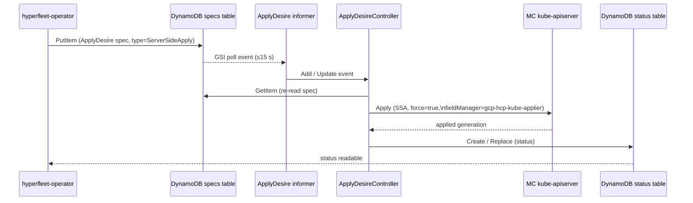
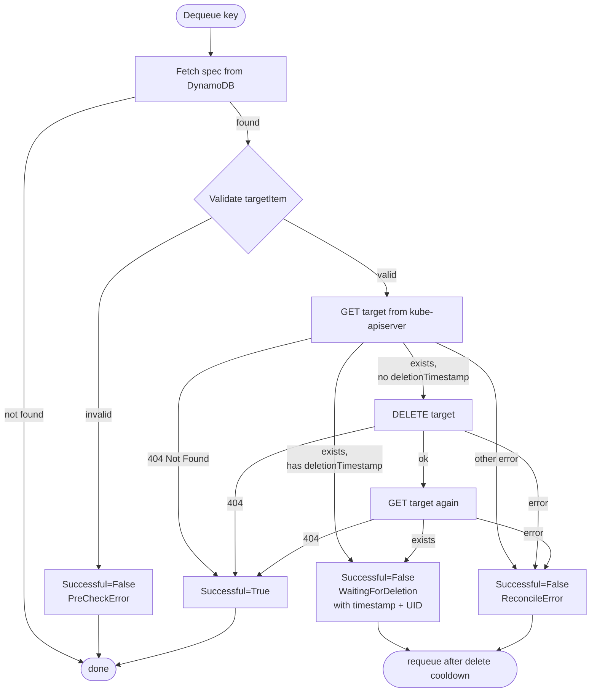

# ApplyDesire Controller

The `ApplyDesireController` reconciles `ApplyDesire` documents. The
`spec.type` field discriminates between two operations:

- **`ServerSideApply`** (default) — reads `spec.serverSideApply.kubeContent`,
  issues a server-side apply (SSA) against the MC kube-apiserver, and writes
  the outcome to the status table.
- **`Delete`** — deletes `spec.targetItem` from the MC kube-apiserver, polling
  until the object is fully gone (finalizers drained).

## Reconcile flow — ServerSideApply

## Reconcile steps — ServerSideApply

1. **Dequeue key** — the worker picks a document ID from the rate-limiting work
   queue.
2. **Fetch spec** — `GetItem` on the specs table. If the document is gone
   (`ErrNotFound`) the controller returns without error; the desire has already
   been removed.
3. **Validate** — `spec.targetItem` must carry `version`, `resource`, and
   `name`. `spec.serverSideApply.kubeContent` must be non-nil and valid JSON.
   Validation failures set `Successful=False` (reason `PreCheckError`) but do
   **not** set `Degraded=True`; they are treated as client-side
   misconfiguration.
4. **Decode** — `spec.serverSideApply.kubeContent` is unmarshalled into an
   `*unstructured.Unstructured`.
5. **Server-side apply** — `dynamic.ResourceInterface.Apply` with
   `FieldManager: "gcp-hcp-kube-applier"` and `Force: true`. Force ensures
   the controller can adopt fields previously owned by a different manager.
6. **Write status** — the result generation, observed desire update time, and
   conditions are persisted to the status table with optimistic concurrency
   (`version` counter). The status writer creates the status item if absent or
   replaces it if present.

## Adoption

Because SSA is issued with `Force: true`, the controller will adopt any
existing Kubernetes resource that matches the GVR + name in `spec.targetItem`,
regardless of what field manager previously owned the fields. This is
intentional: it allows desires to take over resources created by other tooling.

## Reconcile flow — Delete

## Reconcile steps — Delete

1. **Dequeue key** — the worker picks a document ID from the rate-limiting work
   queue.
2. **Fetch spec** — `GetItem` on the specs table. If the document is gone
   (`ErrNotFound`) the controller returns without error.
3. **Validate** — `spec.targetItem` must carry `version`, `resource`, and
   `name`. Failure sets `Successful=False` (reason `PreCheckError`); the key is
   not requeued.
4. **Get target** — retrieves the live object from the MC kube-apiserver. If it
   is already gone, the controller records `Successful=True` and stops.
5. **Check `deletionTimestamp`** — if the object already has a deletion
   timestamp (finalizers are draining), the controller records
   `WaitingForDeletion` and relies on the cooldown-driven requeue to poll again.
6. **Delete** — issues `DELETE` via the dynamic client. A 404 from this call is
   treated as success.
7. **Post-delete get** — re-fetches the object to see whether it disappeared
   immediately or has entered terminating state. The result determines the final
   condition for this reconcile pass.
8. **Write status** — conditions and observed update time are persisted to the
   status table with optimistic concurrency.

The `WaitingForDeletion` message includes the `deletionTimestamp` and UID of
the object so the consumer can distinguish finalizer drain from a completely
new object with the same name.

## Enqueue policy and cooldown

| Event type | Queued immediately? |
|---|---|
| Add (new spec) | Yes |
| Update where `UpdateTime` changed | Yes |
| Update where `UpdateTime` unchanged (informer resync, own status write echo) | Only if cooldown allows |

Two separate cooldown periods apply:

| Type | Cooldown | Reason |
|---|---|---|
| `ServerSideApply` | 10 min | Prevents busy-looping over own status write echoes |
| `Delete` | 1 min | Keeps polling for finalizer completion promptly |

On error the workqueue rate-limiter requeues the key with exponential backoff.

## Conditions

Both conditions are written on every reconcile pass.

### `Successful`

| Reason | Status | Meaning |
|---|---|---|
| `ReconcileSuccess` | `True` | SSA completed (ServerSideApply) or target is gone (Delete) |
| `WaitingForDeletion` | `False` | Object exists with `deletionTimestamp`; controller is polling |
| `PreCheckError` | `False` | Spec is invalid (missing fields, bad JSON, unknown type) |
| `ReconcileError` | `False` | Kube API returned a 4xx or the SSA / Delete call failed |

### `Degraded`

| Value | Meaning |
|---|---|
| absent / `False` | No infrastructure problem |
| `True` | A non-client, non-precondition error occurred (e.g. kube-apiserver unreachable, DynamoDB error) |

Client errors (HTTP 4xx from kube-apiserver) and pre-check errors set
`Successful=False` but leave `Degraded` absent — they reflect desire
misconfiguration, not controller health.

## KubeContent wire format

`spec.serverSideApply.kubeContent` is stored in DynamoDB as a JSON string in
the `spec_kubeContent` S attribute (via `rawext_codec.go`). The controller
unmarshals it on read. The same JSON-string convention applies to
`status.kubeContent` in the status table (`status_kubeContent` S attribute).

For the hyperfleet-operator side of ApplyDesire — how specs are written and
status consumed — see the
[hyperfleet-operator cluster controller doc](https://github.com/typeid/hyperfleet-operator/blob/main/docs/cluster-controller.md).
